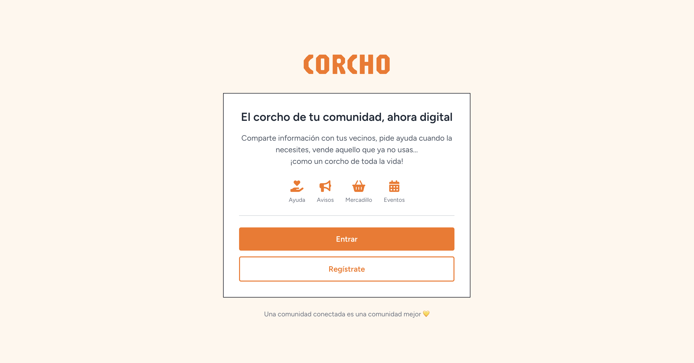
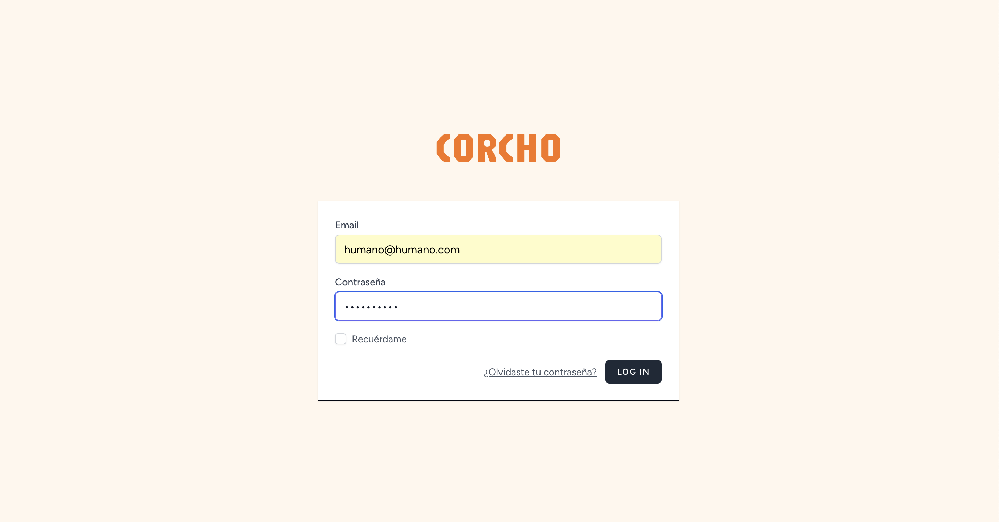
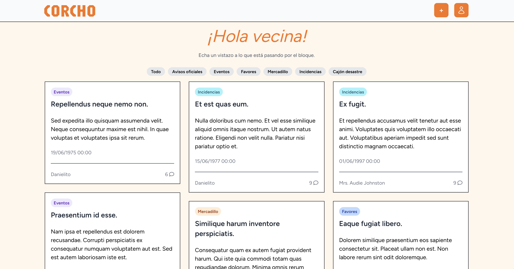
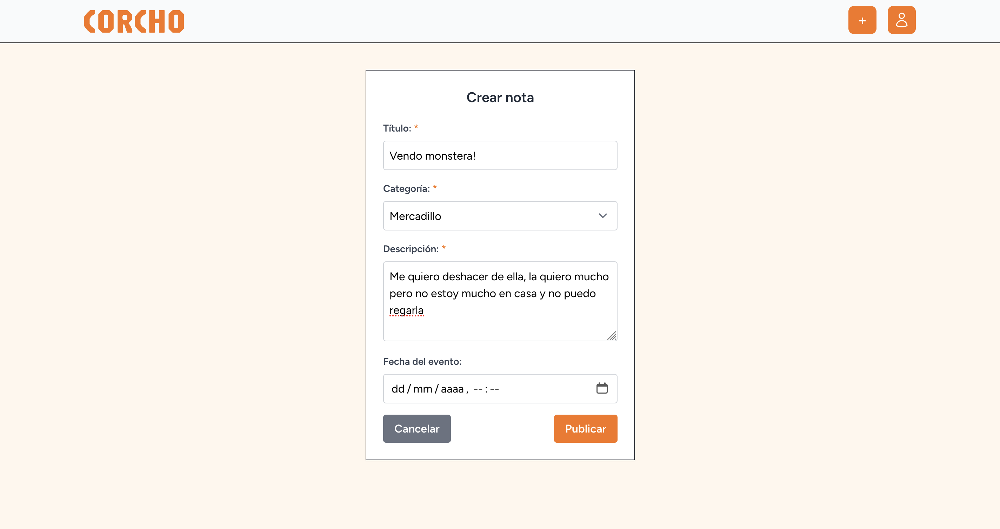
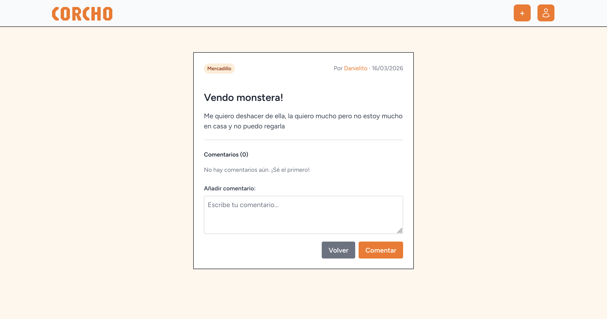
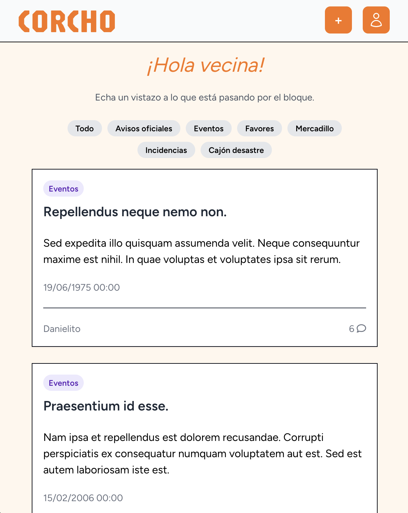

<p align="center">
  
</p>

## Tabla de contenidos

- [Descripción](#descripción)
- [Stack Técnico](#stack-técnico)
- [Funcionalidades](#funcionalidades)
- [Cómo funciona](#cómo-funciona)
- [Instalación](#instalación)
- [Cuenta Demo](#cuenta-demo)
- [Capturas de pantalla](#capturas-de-pantalla)
- [Limitaciones actuales](#limitaciones-actuales)
- [Resolución de problemas](#resolución-de-problemas)
- [Ramas del proyecto](#ramas-del-proyecto)
- [Mejoras futuras](#mejoras-futuras)
- [Metodología](#metodología)

---

## Descripción

Aplicación web para comunidades de vecinos que permite compartir anuncios, pedir ayuda, vender objetos y organizar eventos comunitarios. Inspirado en plataformas como Nextdoor, diseñado para bloques residenciales pequeños.

---

## Stack Técnico

- **Backend**: Laravel 11 (PHP 8.2+)
- **Frontend**: Blade + Alpine.js + Tailwind CSS
- **Base de datos**: MySQL
- **Entorno**: XAMPP
- **Autenticación**: Laravel Breeze

---

## Funcionalidades

- ✅ CRUD completo: notas, comunidades, categorías, comentarios
- ✅ Sistema de agradecimientos entre vecinos
- ✅ Panel de usuario con perfil personalizado
- ✅ Validación de formularios (frontend + backend)
- ✅ Diseño responsivo con Tailwind CSS
- ✅ Sistema de autenticación con Breeze

---

## Cómo funciona

### Notas y Anuncios

Los usuarios pueden crear notas/anuncios en el tablón comunitario. Cada nota puede categorizarse (emergencias, eventos, ventas, ayuda, etc.) y contiene título, descripción y fecha de evento si aplica.

### Comunidades

Cada comunidad de vecinos tiene su propio espacio. Los usuarios se asocian a una comunidad mediante su dirección y número de piso/puerta.

### Sistema de agradecimientos

Los vecinos pueden agradecer publicaciones de otros usuarios, creando un sistema de reconocimiento comunitario.

### Comentarios

Cada nota permite comentarios para facilitar la comunicación entre vecinos.

---

## Instalación

### Prerrequisitos

Asegúrate de tener XAMPP iniciado con **Apache** y **MySQL** activos.

### Clonar y configurar

```bash
git clone https://github.com/DanielVeraMunoz/corchoApp.git
cd corchoApp
composer install
npm install
cp .env.example .env
php artisan key:generate
php artisan migrate
php artisan db:seed
php artisan serve
```

### Iniciar servidores

En una terminal:
```bash
npm run dev
```

En otra terminal:
```bash
php artisan serve
```

Acceder a: **http://127.0.0.1:8000**

---

## Cuenta Demo

Ejecutar `php artisan db:seed` para cargar datos de ejemplo.

| Email | Contraseña |
|-------|------------|
| demo@corcho.com | password |

---

## Capturas de pantalla

**Pantalla de inicio**



**Login**



**Vista de las notas**



**Crear una nota**



**Entrando en una nota**



**Versión movil (responsive)**




---

## Limitaciones actuales

- 🚧 Solo existe un tipo de usuario (vecino). No hay diferenciación entre administrador y usuarios normales.
- 🚧 No hay sistema de notificaciones en tiempo real.
- 🚧 No hay chat interno entre usuarios.
- 🚧 No hay sistema de avisos por email o SMS.
- 🚧 No se pueden subir imágenes/archivos a las notas.
- 🚧 Sistema de recuperación de contraseña no implementado (solo disponible en modo desarrollo/log).

---

## Resolución de problemas

Si experimentas comportamiento inesperado (rutas sin actualizar, cambios de configuración no aplicados, vistas sin refrescar), prueba a limpiar la caché:

```bash
php artisan view:clear
php artisan cache:clear
php artisan config:clear
php artisan route:clear
```

### Correo electrónico

El sistema de recuperación de contraseña está configurado en modo log. Los correos se almacenan en:

```
storage/logs/laravel.log
```

---

## Ramas del proyecto

### `main`

Rama base de Laravel. Contiene el proyecto limpio sin personalizaciones.

### `develop`

Rama de desarrollo con el código actual del proyecto:
- Instalación de Breeze
- Migraciones y seeders
- CRUD completo de notas, comunidades, categorías, comentarios
- Sistema de agradecimientos

---

## Mejoras futuras

Estas son funcionalidades planificadas para futuras versiones:

- 📧 **Sistema de notificaciones por email** - Avisos automáticos cuando hay nuevos anuncios o comentarios
- 📱 **Notificaciones SMS** - Alertas urgentes para emergencias comunitarias
- 👨‍💼 **Panel de administrador** - Interfaz privilegiada para gestionar usuarios, comunidades y contenido
- 💬 **Chat interno** - Sistema de mensajería directa entre vecinos
- 🔔 **Notificaciones en tiempo real** - Alerts sin necesidad de actualizar la página
- 📎 **Subida de archivos** - Adjuntar imágenes y documentos a las notas

---

## Metodología

- GitFlow con ramas feature y Pull Requests
- Migraciones y seeders para base de datos
- Modelo Vista Controlador (MVC)
- Validación en frontend y backend
